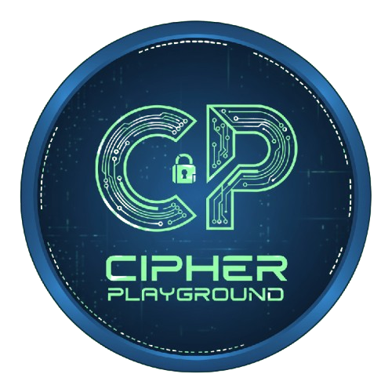

# 🔐 Cipher Playground

<div align="center">



**An interactive web application for exploring classical cryptography**

[](LICENSE)
[](https://react.dev/)
[](https://vitejs.dev/)
[](https://tailwindcss.com/)

[Live Demo](https://cipherplayground.vercel.app) • [Report Bug](https://github.com/rizkwya/cipherplayground/issues)
</div>

---

## ✨ Features

- 🎯 **Real-time Processing**: Instant encryption and decryption as you type
- 🎨 **Modern UI/UX**: Clean, intuitive interface built with Tailwind CSS
- 📱 **Fully Responsive**: Optimized for mobile, tablet, and desktop devices
- 🔍 **Pattern Finder**: Brute-force tool for Random Transposition cipher (up to 40,320 patterns)
- 📋 **Example Presets**: Quick-load examples for each cipher method
- 🌐 **Copy to Clipboard**: One-click copy functionality
- 🎲 **Random Padding**: Smart padding with random letters for better security

---

## 🚀 Quick Start

### Prerequisites

- Node.js 16+ and npm/pnpm/yarn

### Installation

```bash
# Clone the repository
git clone https://github.com/rizkwya/cipherplayground.git

# Navigate to project directory
cd cipherplayground

# Install dependencies
npm install

# Start development server
npm run dev
```

Visit `http://localhost:5173` in your browser.

---

## 🎮 How to Use

1. **Select a Cipher Method** from the dropdown menu
2. **Choose Mode**: Encode or Decode
3. **Enter Your Text** in the input area
4. **Adjust Parameters** (Caesar shift, Rails count, Columnar key, etc.)
5. **View Results** instantly in the output area
6. **Copy or Load Examples** to explore different ciphers

### Available Cipher Methods

| Cipher | Description | Parameters |
|--------|-------------|------------|
| **Atbash** | Reverses the alphabet (A↔Z, B↔Y) | None |
| **ROT13** | Rotates letters by 13 positions | None |
| **Caesar** | Shifts letters by custom amount | Shift (0-25) |
| **Columnar** | Transposes text based on key order | Text or numeric key |
| **Rail Fence** | Writes text in zigzag pattern | Number of rails (2-10) |
| **Random Transposition** | Block transposition with custom pattern | Block size & pattern |
| **Vigenère** | Repeating-key polyalphabetic substitution | Key (letters) |

---

## 🛠️ Built With

- **[React 19](https://react.dev/)** - UI library
- **[Vite](https://vitejs.dev/)** - Build tool & dev server
- **[Tailwind CSS v4](https://tailwindcss.com/)** - Utility-first CSS framework
- **[JavaScript ES6+](https://developer.mozilla.org/en-US/docs/Web/JavaScript)** - Core logic

---

## 📂 Project Structure

```
cipherplayground/
├── public/
│   └── logocp-min.png        # App logo
├── src/
│   ├── components/
│   │   ├── CaesarShiftSlider.jsx
│   │   ├── ColumnarKeyInput.jsx
│   │   ├── Container.jsx
│   │   ├── DownloadFormatDropdown.jsx
│   │   ├── ExampleDropdown.jsx
│   │   ├── MethodDropdown.jsx
│   │   ├── ModeSwitcher.jsx
│   │   ├── RailsSlider.jsx
│   │   ├── RandomSeedInput.jsx
│   │   ├── TextAreaCard.jsx
│   │   ├── Toast.jsx
│   │   ├── LyricFooter.jsx
│   │   ├── UIComponents.jsx
│   │   └── VigenereKeyInput.jsx
│   ├── utils/
│   │   ├── cipherFunctions.js      # Core cipher algorithms
│   │   ├── dictionaryWords.js
│   │   ├── downloadDocx.js
│   │   ├── downloadPDF.js
│   │   ├── excelExport.js
│   │   ├── generateConsistentFileName.js
│   │   ├── parsePdfFile.js
│   │   ├── patternDetector.js
│   │   └── showError.js
│   ├── App.jsx                     # Main application
│   ├── main.jsx                    # Entry point
│   └── index.css                   # Global styles
├── index.html
├── package.json
├── vite.config.js
└── README.md
```

---

## 🎯 Key Features Explained

### Pattern Finder (Random Transposition)

For block sizes 2-8, the Pattern Finder generates all possible permutations and attempts to decode your ciphertext:

- **Block Size 2**: 2 patterns
- **Block Size 3**: 6 patterns
- **Block Size 4**: 24 patterns
- **Block Size 8**: 40,320 patterns (max supported)

Perfect for cryptanalysis and learning!

### Smart Padding

When text length doesn't match block requirements:
- **Random letter padding** (a-z) is automatically added
- **Reversible**: Padding is preserved during encode/decode cycles
- Works for both Columnar and Random Transposition ciphers

---

## 🤝 Contributing

Contributions are welcome! Feel free to:

1. Fork the project
2. Create your feature branch (`git checkout -b feature/AmazingFeature`)
3. Commit your changes (`git commit -m 'Add some AmazingFeature'`)
4. Push to the branch (`git push origin feature/AmazingFeature`)
5. Open a Pull Request

---

## 📝 License

This project is licensed under the MIT License - see the [LICENSE](LICENSE) file for details.

---

## 👤 Author

**rizk**

- GitHub: [@rizkwya](https://github.com/rizkwya)
- Instagram: [@sannnbieber](https://instagram.com/sannnbieber)

---

## 🙏 Acknowledgments

- Inspired by classical cryptography and the need for educational tools
- Built with modern web technologies for optimal performance
- Thanks to the open-source community for amazing tools and libraries

---

<div align="center">

**⭐ Star this repo if you find it useful!**

Made with ❤️ by [rizk](https://github.com/rizkwya)

</div>

